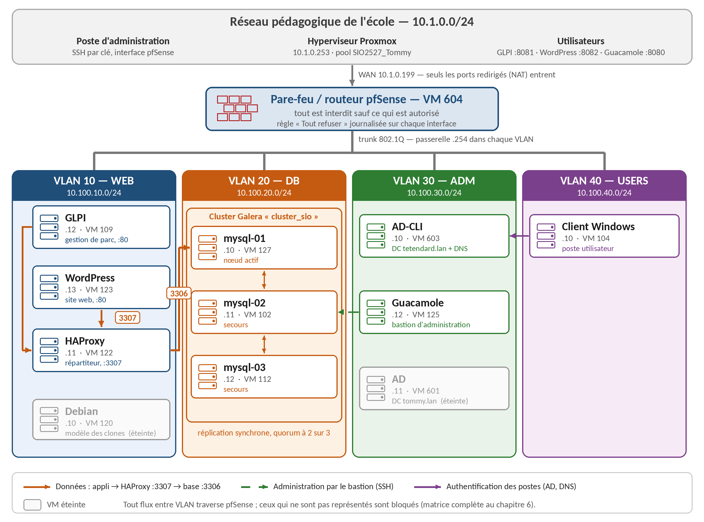

# Projet pro — BTS SIO SISR

GLPI et WordPress installés sur un cluster de 3 bases MariaDB. Si une base tombe, les sites continuent de marcher.

- `Documentations/` : le DAT (l'architecture du projet)
- `Procédures/` : comment monter le cluster, puis installer GLPI et WordPress dessus

Tommy Etendard
